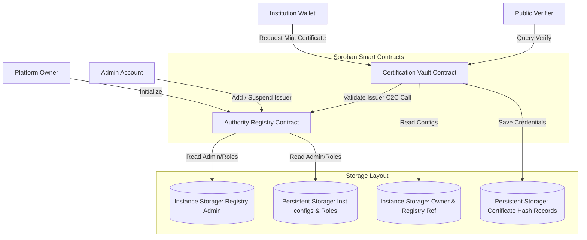
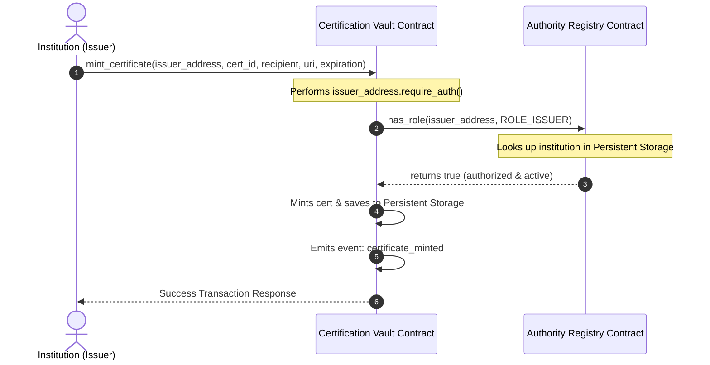

<h1 align="center">📜 VedaCert Credentialing 🔗</h1>

<p align="center">
  <strong>A Decentralized, Tamper-Proof Credential Verification Platform built on the Stellar network using decoupled Soroban smart contracts.</strong>
</p>

<p align="center">
  <a href="https://vedacert.vercel.app/" target="_blank">
    
  </a>
</p>

<p align="center">
  <a href="https://github.com/charlie2707/VedaCert/actions/workflows/ci.yml" target="_blank">
    
  </a>
</p>

<p align="center">
  <a href="#overview">Overview</a> •
  <a href="#tech-stack">Tech Stack</a> •
  <a href="#directory-structure">Directory Structure</a> •
  <a href="#architecture">Architecture</a> •
  <a href="#development">Development</a> •
  <a href="#deployment-guide">Deployment Guide</a> •
  <a href="#screenshots">Screenshots</a>
</p>

---

* **GitHub Repository:** [charlie2707/VedaCert](https://github.com/charlie2707/VedaCert)
* **Walkthrough Demo Video:**

[VedaCert Demo Video Link]

---

## 📌 Table of Contents

* [1. Product Overview & Problem Statement](#overview)
  * [The Problem](#the-problem)
  * [The VedaCert Solution](#the-vedacert-solution)
* [2. Technical Stack](#tech-stack)
* [3. Directory Structure](#directory-structure)
* [4. Technical Architecture & Component Flow](#architecture)
  * [1. Decoupled Access Control Flow](#decoupled-flow)
  * [2. Inter-Contract Communication Sequence](#inter-contract-communication)
* [5. Smart Contract Design](#contract-design)
  * [Data Storage & TTL Preservation](#storage-design)
  * [Access Control](#access-control)
* [6. Local Development & Testing](#development)
  * [Prerequisites](#prerequisites)
  * [Compilation & Testing](#compilation-testing)
  * [Frontend Development](#frontend-dev)
* [7. Stellar Testnet Deployment Guide](#deployment-guide)
  * [Step 1: Configure Deployer Identity](#deployer-identity)
  * [Step 2: Compile WASM Bytecodes](#compile-wasm)
  * [Step 3: Deploy Authority Registry](#deploy-registry)
  * [Step 4: Deploy Certification Vault](#deploy-vault)
  * [Step 5: Initialize Contracts & Authorize Issuer](#initialize-contracts)
* [8. Deployed Contract Verification](#verification)
  * [On-Chain Contract Verification Links](#verification-links)
* [9. Security Considerations](#security)
* [10. Project Media & Screenshots](#screenshots)

---

<a name="overview"></a>
## 🔍 1. Product Overview & Problem Statement

### The Problem
Traditional educational credentials and enterprise certificates rely on centralized databases or paper verification, which are vulnerable to record tampering, database leaks, and validation latencies. Institutions must maintain expensive validation APIs, and verifiers must manually request verification, causing settlement times of days or weeks.

### The VedaCert Solution
VedaCert resolves these structural limitations using:
* **Decoupled Registry Authority**: Institutions are registered under custom roles (ROLE_ADMIN, ROLE_ISSUER, ROLE_AUDITOR) in a secure global identity registry.
* **On-Chain Vault Storage**: Certificates are cryptographically hashed and anchored into permanent, decentralized vault storage with instant on-chain verification.
* **Contract-to-Contract (C2C) Verification**: The vault validates the issuer's active authority dynamically in real-time before anchoring any document.

---

<a name="tech-stack"></a>
## 🛠️ 2. Technical Stack

* **Smart Contracts:** Rust, Soroban SDK
* **Frontend:** Next.js 15 (App Router), TypeScript, Tailwind CSS, lucide-react
* **State Management:** Zustand (wallet session persistence, transaction center logs)
* **Data Querying:** React Query (RPC state synchronization)
* **Wallet Connection:** `@creit.tech/stellar-wallets-kit` SDK (Freighter / xBull / LOBSTR)
* **Web3 Design Aesthetics:** Glowing dark-mode theme, glassmorphic layout, mobile responsive grids.

---

<a name="directory-structure"></a>
## 📂 3. Directory Structure

The project is organized with a feature-based architecture separating smart contracts, deployment tools, and the Next.js frontend app:

```
VedaCert/
├── .github/
│   └── workflows/
│       └── ci.yml                     # CI/CD Pipeline Configuration
├── contracts/
│   ├── authority-registry/
│   │   ├── src/
│   │   │   ├── lib.rs                 # Registry contract rules & RBAC
│   │   │   └── test.rs                # Registry unit test suite
│   │   └── Cargo.toml                 # Registry manifest
│   └── certification-vault/
│       ├── src/
│       │   ├── lib.rs                 # Vault contract rules & C2C calls
│       │   └── test.rs                # Vault unit test suite
│       └── Cargo.toml                 # Vault manifest
├── scripts/
│   └── deploy.js                      # Automated Testnet deploy script
└── frontend/
    ├── src/
    │   ├── app/
    │   │   ├── dashboard/             # Institution admin workspace
    │   │   ├── settings/              # Settings & Custom Contract binding
    │   │   └── page.tsx               # Home & Public Verification page
    │   ├── components/                # Header, Footer, Providers
    │   ├── services/
    │   │   └── stellar.ts             # Transaction building & signing layers
    │   └── state/
    │       └── walletStore.ts         # Zustand wallet status manager
    │       └── feedStore.ts           # Zustand global activity event store
    │       └── txStore.ts             # Zustand transaction status store
    ├── package.json                   # Frontend node packages
    └── tsconfig.json                  # TypeScript settings
```

---

<a name="architecture"></a>
## 📐 4. Technical Architecture & Component Flow

<a name="decoupled-flow"></a>
### 1. Decoupled Access Control Flow



<a name="inter-contract-communication"></a>
### 2. Inter-Contract Communication Sequence



---

<a name="contract-design"></a>
## 📜 5. Smart Contract Design

<a name="storage-design"></a>
### Data Storage & TTL Preservation
* **Instance Storage**: Used for configuration flags, referencing target contract variables, and owner parameters (e.g. `Admin` in the registry and `Owner`/`Registry` references in the vault) to optimize transaction footprints.
* **Persistent Storage**: Holds registry institution profiles (`InstitutionConfig`) and hash verification structures (`CertificateData`) with Soroban state leases to guarantee permanent storage integrity.

<a name="access-control"></a>
### Access Control
* **Authorization Enforcement**: Every state-modifying function enforces authorization signatures using `address.require_auth()`.
* **Inter-Contract Verification**: The Vault contract verifies that the caller has the authorized issuer role by calling `has_role(issuer, ROLE_ISSUER)` in the Registry contract dynamically via a contract-to-contract call.

---

<a name="development"></a>
## 🧪 6. Local Development & Testing

<a name="prerequisites"></a>
### Prerequisites
* Rust & Cargo (with `wasm32-unknown-unknown` target configured)
* Node.js v20+

<a name="compilation-testing"></a>
### Compilation & Testing
```bash
# Run contract unit tests
cargo test

# Compile optimized WASM binaries
cargo build --target wasm32-unknown-unknown --release
```

<a name="frontend-dev"></a>
### Frontend Development
```bash
cd frontend
npm install --ignore-scripts
npm run dev
```

---

<a name="deployment-guide"></a>
## 🚀 7. Stellar Testnet Deployment Guide

<a name="deployer-identity"></a>
### Step 1: Configure Deployer Identity
Generate and fund a test account:
```bash
stellar keys generate vini --network testnet --fund
```

<a name="compile-wasm"></a>
### Step 2: Compile WASM targets
```bash
cargo build --target wasm32-unknown-unknown --release
```
This generates the optimized WASM files in `target/wasm32-unknown-unknown/release/` (or `target/wasm32v1-none/release/` depending on the active rust toolchain target).

<a name="deploy-registry"></a>
### Step 3: Deploy Authority Registry
```bash
stellar contract deploy \
  --wasm target/wasm32v1-none/release/authority_registry.wasm \
  --source-account vini \
  --network testnet \
  --alias authority_registry
```
* **Output Address**: `CALO4ABMH7IZBV5HBHOFUGQRZSB6AMLU4YQHABG23NVJ5PEQJC22L2NK`

<a name="deploy-vault"></a>
### Step 4: Deploy Certification Vault
```bash
stellar contract deploy \
  --wasm target/wasm32v1-none/release/certification_vault.wasm \
  --source-account vini \
  --network testnet \
  --alias certification_vault
```
* **Output Address**: `CDSIRMRE43V475FH2Y2FVKONSZYOBLI7F3CLA4HKEYAJ6LDQ45AVNVAF`

<a name="initialize-contracts"></a>
### Step 5: Initialize Contracts & Authorize Issuer

1. **Initialize the Registry**:
```bash
stellar contract invoke \
  --id CALO4ABMH7IZBV5HBHOFUGQRZSB6AMLU4YQHABG23NVJ5PEQJC22L2NK \
  --source-account vini \
  --network testnet \
  -- initialize \
  --admin GBWDU3MGRM7KSDQBUPHXZS5FDD2T4LURXDNZRJ34FJIZOD6U4YW7N6WP
```

2. **Initialize the Vault** (binding it to the Registry address):
```bash
stellar contract invoke \
  --id CDSIRMRE43V475FH2Y2FVKONSZYOBLI7F3CLA4HKEYAJ6LDQ45AVNVAF \
  --source-account vini \
  --network testnet \
  -- initialize \
  --owner GBWDU3MGRM7KSDQBUPHXZS5FDD2T4LURXDNZRJ34FJIZOD6U4YW7N6WP \
  --registry CALO4ABMH7IZBV5HBHOFUGQRZSB6AMLU4YQHABG23NVJ5PEQJC22L2NK
```

3. **Register vini as an authorized ROLE_ISSUER (Role = 2)**:
```bash
stellar contract invoke \
  --id CALO4ABMH7IZBV5HBHOFUGQRZSB6AMLU4YQHABG23NVJ5PEQJC22L2NK \
  --source-account vini \
  --network testnet \
  -- add_institution \
  --admin GBWDU3MGRM7KSDQBUPHXZS5FDD2T4LURXDNZRJ34FJIZOD6U4YW7N6WP \
  --institution GBWDU3MGRM7KSDQBUPHXZS5FDD2T4LURXDNZRJ34FJIZOD6U4YW7N6WP \
  --name "Platform Root Issuer" \
  --role 2
```

---

<a name="verification"></a>
## 📊 8. Deployed Contract Verification

<a name="verification-links"></a>
### On-Chain Contract Verification Links

Once deployed, you can verify contract addresses and transaction logs on StellarExpert:

| Contract / TX | Address / Hash | Explorer Link |
| --- | --- | --- |
| **Authority Registry Contract** | `CALO4ABMH7IZBV5HBHOFUGQRZSB6AMLU4YQHABG23NVJ5PEQJC22L2NK` | [View on StellarExpert](https://stellar.expert/explorer/testnet/contract/CALO4ABMH7IZBV5HBHOFUGQRZSB6AMLU4YQHABG23NVJ5PEQJC22L2NK) |
| **Certification Vault Contract** | `CDSIRMRE43V475FH2Y2FVKONSZYOBLI7F3CLA4HKEYAJ6LDQ45AVNVAF` | [View on StellarExpert](https://stellar.expert/explorer/testnet/contract/CDSIRMRE43V475FH2Y2FVKONSZYOBLI7F3CLA4HKEYAJ6LDQ45AVNVAF) |
| **Sample Minting TX Hash** | `f290d957bdaf974d3672bf665e9b48f9624f1ba7eb12821d45a69be735f980ac` | [View on StellarExpert](https://stellar.expert/explorer/testnet/tx/f290d957bdaf974d3672bf665e9b48f9624f1ba7eb12821d45a69be735f980ac) |

---

<a name="security"></a>
## 🛡️ 9. Security Considerations

* **Decoupled Roles checks**: Dynamic role validations checked dynamically using C2C calls during validation steps.
* **Storage Leases**: Automated persistent storage leases built directly to prevent state deletion.

---

<a name="screenshots"></a>
## 📸 10. Project Media & Screenshots

<!-- Screenshot Placeholder: Desktop UI -->
### Desktop View


### Mobile Responsive View


### Multi-Wallet Integration


<!-- Screenshot Placeholder: CI/CD Pipeline -->
### Deployed Testnet Transaction


### CI/CD Pipeline


### Test Output

