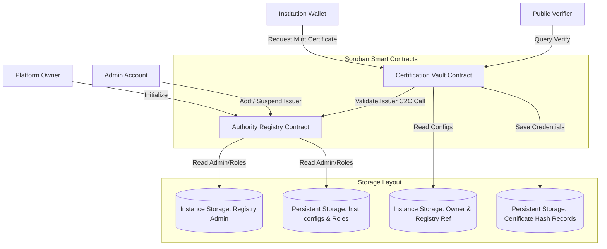
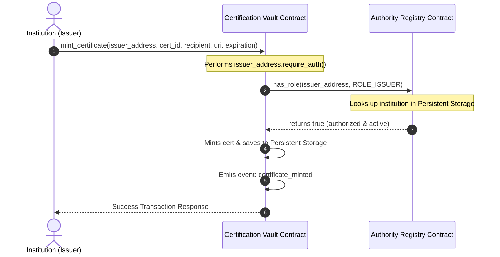

# VedaCert - Decentralized Certification Verification Platform

VedaCert is a modern, tamper-proof credentialing platform built on Stellar/Soroban that bridges traditional institutional authority with decentralized cryptographic verification. 

By separating access control from credential anchoring into a decoupled, two-contract smart architecture, VedaCert allows academic institutions and enterprises to securely mint, manage, and instantly verify digital certificates without relying on centralized databases or proprietary API keys.

---

## 🏛️ System Architecture

VedaCert separates authorization and verification logic to ensure maximum security, modularity, and operational independence.



### Inter-Contract Communication (C2C) Flow



---

## ⚙️ Smart Contract Storage Design

VedaCert applies strict storage selection to optimize resource usage and prevent ledger bloat:

1. **Instance Storage**:
   - Used for global parameters and frequently modified tracking variables with high access frequencies (e.g., `Admin` in the registry and `Owner` / `Registry` references in the vault).
   - This keeps fee configurations predictable and updates simple.

2. **Persistent Storage**:
   - Used for large and unbounded dataset structures (e.g., `InstitutionConfig` map and `CertificateData` hash mappings).
   - Keeps data secure on the ledger indefinitely, utilizing Soroban state lease renewal models to prevent automatic archival.

---

## 🛠️ Tech Stack & Monorepo Features

- **Smart Contracts**: Soroban Rust SDK, C2C invocation client interfaces, and robust mock testing.
- **Frontend**: Next.js 15 App Router, TypeScript, Tailwind CSS v4, Zustand (state engine), and TanStack React Query.
- **Wallet Connection**: `@creit.tech/stellar-wallets-kit` providing Freighter, xBull, and LOBSTR support.
- **Styling**: Sleek "Web3 Dark Space" glassmorphism with radial glow vectors, monochromatic buttons, and fluorescent transaction status cues.
- **Testing**: Rust unit tests + Vitest frontend and integration simulation tests.
- **CI/CD**: GitHub Actions compiling contracts, running tests, and preparing bundles on pull requests.

---

## 🚀 Local Development & Environment Configuration

### 1. Prerequisites
- Rust & Cargo (with `wasm32-unknown-unknown` target configured)
- Node.js v20+

### 2. Environment Setup
Copy the configuration template:
```bash
cp .env.example .env
```
Populate `.env` with your Stellar testnet keys if you already have them, or leave blank to automatically generate funded developer keys.

### 3. Compile & Test Smart Contracts
From the workspace root, run the test suites:
```bash
# Run Rust smart contract unit tests
cargo test --target-dir build_target -j 1
```

### 4. Run Frontend Development Server
Configure and start the Next.js local server:
```bash
cd frontend
npm install --ignore-scripts
npm run dev
```
Open `http://localhost:3000` to browse the interactive Web3 workspace.

### 5. Run Frontend & E2E Integration Tests
Run components and integration tests using Vitest:
```bash
cd frontend
npx vitest run
```

---

## 🛰️ Testnet Deployment Step-by-Step

VedaCert includes automated scripts to build, fund, and deploy both contracts to Stellar Testnet:

1. **Build the WASM binaries**:
   ```bash
   cargo build --target wasm32-unknown-unknown --release --target-dir build_target -j 1
   ```

2. **Deploy via Node.js**:
   From the repository root, run the script:
   ```bash
   node scripts/deploy.js
   ```

   The script will:
   - Generate or fund the keys configured in `.env`.
   - Compile and submit WASM files to Testnet.
   - Instantiation and initialization of `AuthorityRegistry` and `CertificationVault`.
   - Register the deployer key as a registered authority (`ROLE_ISSUER`).
   - Output the deployed contract addresses directly to `frontend/src/contracts/addresses.json`.

3. **Link Frontend to Contracts**:
   Paste the generated contract IDs into your frontend `.env` file:
   ```ini
   NEXT_PUBLIC_REGISTRY_CONTRACT_ID=<REGISTRY_ADDRESS_FROM_OUTPUT>
   NEXT_PUBLIC_VAULT_CONTRACT_ID=<VAULT_ADDRESS_FROM_OUTPUT>
   ```

---

## 🔒 Security Considerations

- **Role-Based Access Control (RBAC)**: Smart contract administration functions require signatures checked via `require_auth()` matching the saved `Admin`/`Owner` instances.
- **Contract-to-Contract Validation**: The Vault contract never assumes issuer status; it queries the Registry database via a secure C2C call during every mint attempt.
- **Lease Limits & Fee Management**: Storage slots use Soroban persistent lease mechanics. Safe margins are configured for client transactions to prevent out-of-gas errors.
- **Security Audit Trails**: Events are emitted for every role change and certificate lifecycle transition (minting, revocation, state updates).

---

## 📜 Deployed Contract Addresses

Below are the addresses representing the deployed contracts on Stellar Testnet:

*   **Authority Registry Contract Address**: `CALO4ABMH7IZBV5HBHOFUGQRZSB6AMLU4YQHABG23NVJ5PEQJC22L2NK`
*   **Certification Vault Contract Address**: `CDSIRMRE43V475FH2Y2FVKONSZYOBLI7F3CLA4HKEYAJ6LDQ45AVNVAF`
*   **Sample Genesis Transaction Hash**: `f290d957bdaf974d3672bf665e9b48f9624f1ba7eb12821d45a69be735f980ac`
*   **StellarExplorer Reference**: [StellarExpert Testnet Explorer](https://stellar.expert/explorer/testnet)

---

## 🎥 Demos & Video Placeholders
- [Walkthrough Screen Capture (GIF/Video)] - Add demonstration recordings here.
